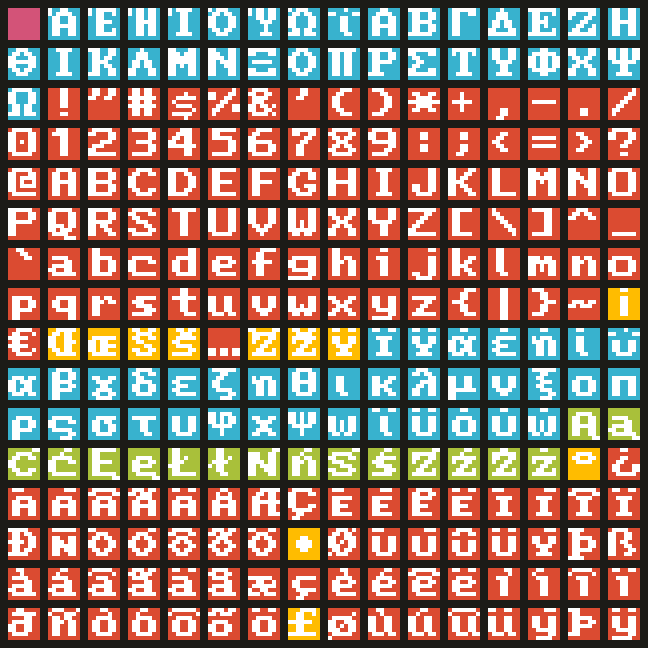

# CP0-EU
## Non-standard character set and 8x8 font supporting many European languages

CP0-EU is a non-standard character set for small displays and LED matrices supporting as many European languages as possible within the limit of 256 characters.
It's mainly based on CP-1252, but with the omission of all control characters and several punctuation marks, to make room for uppercase and lowercase Greek and Polish characters.
In addition to the charset definition, CP0-EU comes with a C header file describing each character as an 8x8 glyph and a lookup table to match each CP0-EU character to a Unicode codepoint.

The font has been assembled from different public domain sources (notably, IBM fonts) and integrated with numerous custom glyphs.


### Supported languages
Afrikaans, Albanian, Basque, Breton, Catalan, Corsican, Danish, Dutch, English, Estonian, Faroese, Finnish, French, Galician, German, Greek (modern; ancient without breathings), Icelandic, Ido, Indonesian, Irish, Italian, Latin, Leonese, Lojban, Luxembourgish, Malay, Manx, Norwegian, Occitan, Portuguese, Rhaeto-Romanic, Romansh, Rotokas, Scots, Scottish Gaelic, Sicilian, Slovene, Southern Sami, Spanish, Swahili, Swedish, Tagalog, Toki Pona, Tswana, Walloon.


### Character set
```
  Ά Έ Ή Ί Ό Ύ Ώ ΐ Α Β Γ Δ Ε Ζ Η
Θ Ι Κ Λ Μ Ν Ξ Ο Π Ρ Σ Τ Υ Φ Χ Ψ
Ω ! " # $ % & ' ( ) * + , - . /
0 1 2 3 4 5 6 7 8 9 : ; < = > ?
@ A B C D E F G H I J K L M N O
P Q R S T U V W X Y Z [ \ ] ^ _
` a b c d e f g h i j k l m n o
p q r s t u v w x y z { | } ~ ¡
€ Œ œ Š š … Ž ž Ÿ Ϊ Ϋ ά έ ή ί ΰ
α β γ δ ε ζ η θ ι κ λ μ ν ξ ο π
ρ ς σ τ υ φ χ ψ ω ϊ ϋ ό ύ ώ Ą ą
Ć ć Ę ę Ł ł Ń ń Ś ś Ź ź Ż ż ° ¿
À Á Â Ã Ä Å Æ Ç È É Ê Ë Ì Í Î Ï
Ð Ñ Ò Ó Ô Õ Ö • Ø Ù Ú Û Ü Ý Þ ß
à á â ã ä å æ ç è é ê ë ì í î ï
ð ñ ò ó ô õ ö £ ø ù ú û ü ý þ ÿ
```

<br>
In the image above:
- Pink: space
- Red: CP-1252 characters in their original position
- Yellow: CP-1252 characters in a new position
- Blue: Greek characters
- Green: Polish characters


### Examples
Danish: 
English: 
Greek: 
Icelandic: 
Irish: 
Polish: 


### Projects using this library
- [RP2040-WS2812B-Animation](https://github.com/TuriSc/RP2040-WS2812B-Animation)


### Version history
- 2023-11-24 - v1.0.0 - First release
